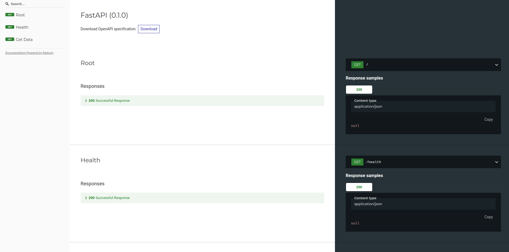

# Cassandra API

## Description
Its an API for accessing cassandra database for the <a href="https://github.com/HassanRady/Tweets-Stream-Text-Analysis">dashboard app</a>.

1. Create a keyspace
2. Create a table for accessing offline data
3. Create a table for accessing online data
4. Insert data into the offline table

When the <a href="https://github.com/HassanRady/Tweets-Stream-Text-Analysis">dashboard</a> is opened, it will show the data from the offline table.


## Documentation



Get Data endpoint success output:
```json
{
  "text": [],
  "author_id": [],
  "topic": [],
}
```

## Run
Two ways to run the api:

bash run.sh:
```sh
    $ python -m venv .venv
    $ source .venv/bin/activate
    $ pip install -r requirements.txt
    $ uvicorn app:app --host 127.0.0.1 --port 9000 --reload
```
Or

docker container:
```docker
    $ docker build . -t cassandra-reader
    $ docker run -p 9000:9000 -d --name cassandra-reader cassandra-reader
